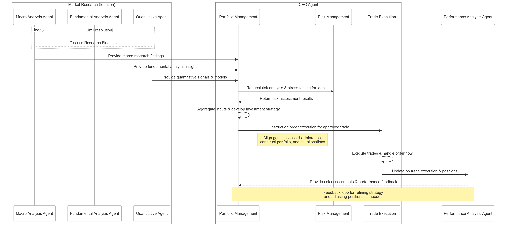

# AI Hedge Fund

A revolutionary hedge fund management system powered entirely by AI agents, each specializing in different aspects of fund operations, from market research to trade execution and performance analysis.

## Overview

This project implements an autonomous hedge fund management system where specialized AI agents work together to make investment decisions, execute trades, and manage risk. Each agent has specific responsibilities and interacts with others to ensure efficient fund operations.

## AI Agent Architecture

### Research & Analysis
1. **Macro Analysis Agent (MA)**
   - Collects macroeconomic data
   - Monitors geopolitical events
   - Analyzes market trends

2. **Fundamental Analysis Agent (FA)**
   - Assesses company financials
   - Evaluates industry health
   - Performs bottom-up analysis

3. **Quantitative Agent (QA)**
   - Runs quantitative models
   - Generates trading signals
   - Performs backtesting
   - Processes alternative data

### CEO Agent Functions
4. **Portfolio Management (PM)**
   - Makes trade incorporation decisions
   - Manages portfolio construction
   - Aggregates research findings
   - Develops investment strategies

5. **Risk Management (RM)**
   - Performs stress testing
   - Conducts risk analysis
   - Monitors positions
   - Suggests portfolio adjustments

6. **Trade Execution (TE)**
   - Executes approved trades
   - Handles order placement
   - Implements smart routing
   - Optimizes execution algorithms

### Analysis
6. **Performance Analysis Agent (PAA)**
   - Tracks performance
   - Performs post-trade analysis
   - Provides feedback for strategy refinement
   - Monitors risk metrics

## How It Works

### Idea Generation
The research agents (MA, FA, QA) send their insights directly to Portfolio Management, which synthesizes these inputs into coherent investment strategies.

### Strategy & Risk Assessment
Portfolio Management develops strategies and consults with Risk Management for assessment and stress testing. The integrated approach ensures risk considerations are built into the strategy development process.

### Execution
Once approved, Trade Execution handles all aspects of order execution, including smart routing and algorithmic trading optimization.

### Ongoing Management
Risk Management continuously monitors positions while the Performance Analysis Agent provides feedback to Portfolio Management. This creates a continuous improvement loop for strategy refinement and risk management.

## System Architecture

The following sequence diagram illustrates the interaction flow between different AI agents in the hedge fund system:

The diagram shows the complete workflow from initial market research to performance analysis:
1. Market Research (Ideation) Phase
   - Discovery Agent, Fundamental Analysis Agent, and Quantitative Agent provide research findings to Portfolio Management

2. Strategy Development & Risk Assessment
   - Portfolio Management requests risk analysis from Risk Management
   - Risk Management returns assessment results
   - Portfolio Management aggregates inputs and develops investment strategy

3. Trade Execution
   - Portfolio Management instructs Trade Execution on order execution
   - Trade Execution executes trades and handles order flow

4. Performance & Risk Analysis
   - Trade Execution updates Performance Analysis Agent on execution and positions
   - Performance Analysis Agent provides risk assessments and performance feedback to Portfolio Management
   - Continuous feedback loop for strategy refinement

## Getting Started

TBA